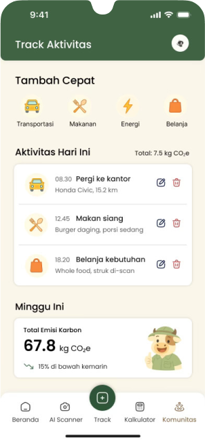

## Deskripsi

EcoTrack adalah aplikasi mobile yang memungkinkan pengguna untuk melacak, memahami, dan mengurangi jejak karbon harian mereka. Dengan menggabungkan AI, Computer Vision, dan gamifikasi, aplikasi ini dapat membantu pengguna melacak jejak karbon secara akurat dan mudah digunakan dalam kehidupan sehari-hari.

---
<br/>

<p align="center">
   
</p>

## Pemanfaatan AI

- OCR & Food Recognition
- Carbon Calculator
- Chatbot RAG
- Rekomendasi AI

---
<br/>

## Features

- Onboarding interaktif dan ramah pengguna untuk memudahkan orientasi awal.
- Visualisasi data progres dalam bentuk grafik, target harian, dan dashboard analitik.
- Fitur Gamifikasi berupa tantangan, leaderboard, sistem badge, dan komunitas interaktif.

---
<br/>

## Tech Stack

- **Frontend:** React Native
- **Backend:** Django REST Framework
- **Database:** PostgreSQL
- **AI Engine:** EasyOCR, YOLOv8, TensorFlow
- **Model Deployment:** Google Cloud Run
- **AI Chatbot:** OpenRouter (RAG-based)

---
<br/>

## Backend Repository

Dapat diakses pada link berikut [Backend](https://github.com/azfaradhi/EcoTrack-Backend) 

<br/>

## How to Run


1. Clone repository
   ```bash
   git clone https://github.com/AlthariqFairuz/EcoTrack
   ```


2. Install dependencies

   ```bash
   npm install
   ```

3. Start the app

- **Menggunakan Emulator Android:**
   ```bash
   npm run android
   ```

- **Menggunakan Expo Go:**
   ```bash
   npx expo start
   ```
   Untuk menggunakan Expo Go, pastikan aplikasi Expo Go sudah terpasang di perangkat Anda dan perangkat berada dalam satu jaringan WiFi dengan komputer pengembang.

Catatan: Aplikasi ini berjalan sempurna pada android, namun butuh beberapa pengembangan lanjut pada ios.

## Our Team
1. Adinda Putri
2. Azfa Radhiyya Hakim
3. Barru Adi Utomo
4. Muhammad Al Thariq Fairuz
5. Randy Verdian
---
